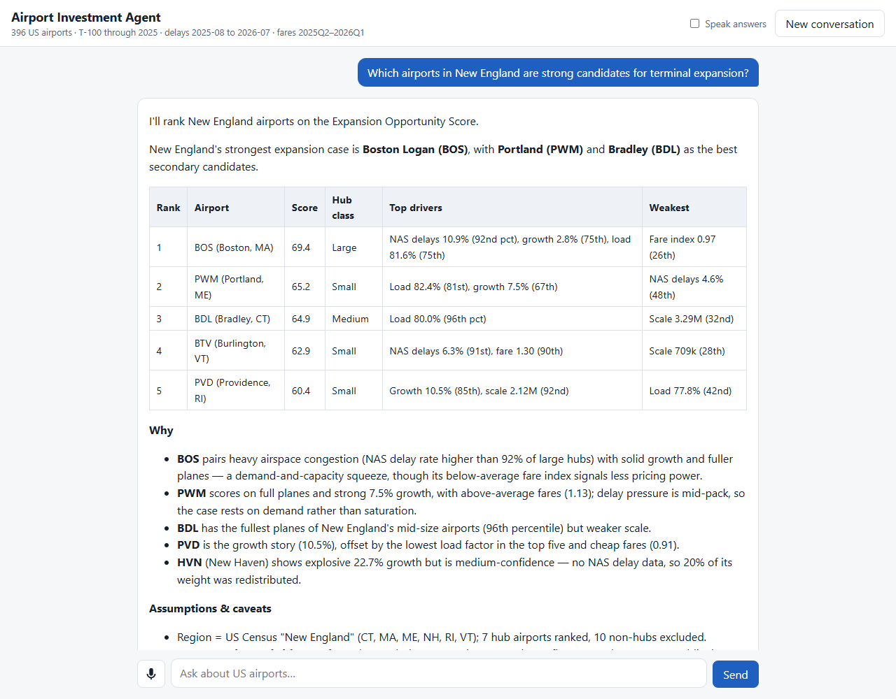

# Airport Investment Intelligence Agent

A chat agent that ranks and compares US airports by how well demand supports terminal expansion. It uses public BTS, DOT and FAA data, scores airports deterministically, and explains its reasoning. Voice input and spoken answers are supported.



Design, scoring methodology and tradeoffs: **[docs/DESIGN.md](docs/DESIGN.md)**.

## Run

Requires Node 22+.

```bash
npm install
cp .env.example .env      # add GOOGLE_API_KEY and/or DEEPSEEK_API_KEY
npm run dev               # http://localhost:3000
```

The data snapshot is committed. `npm run ingest` rebuilds it from the public sources.

## Other commands

- `npm test`: unit, agent and API tests
- `npm run check`: typecheck, lint, format
- `npm run eval`: ask the brief's questions to the real LLM and check the tools it picks
